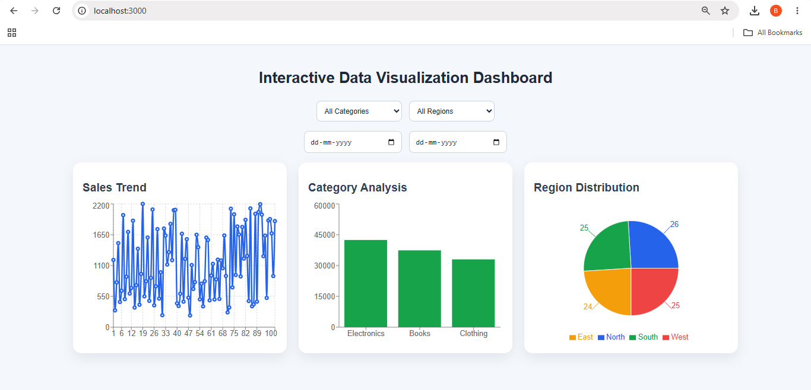
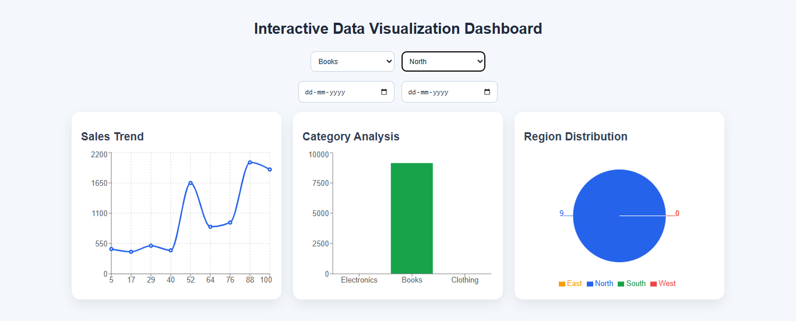
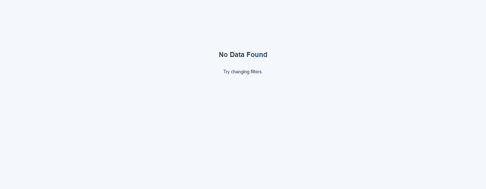
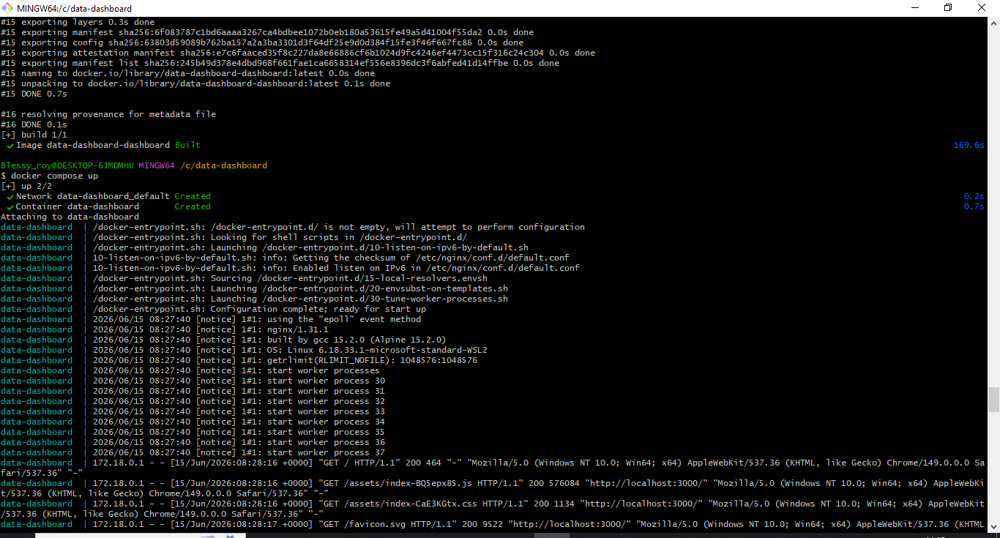
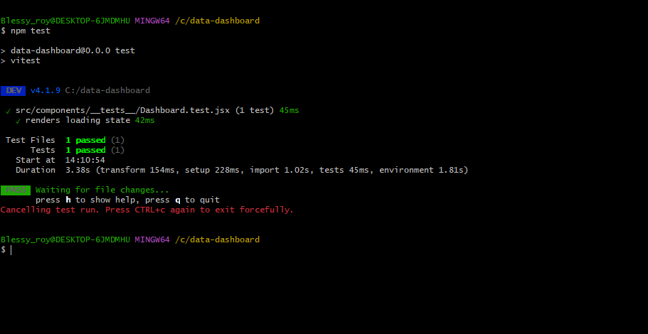

# 📊 Interactive Data Visualization Dashboard

A responsive and interactive data visualization dashboard built with **React** and **Recharts**. The application enables users to analyze sales data through multiple chart visualizations, dynamic filters, loading states, error handling, and responsive UI design.

---

## 🚀 Live Demo

🔗 Vercel Deployment: https://dynamicfilteringdashboard.vercel.app/
---

# 📖 Project Overview

This project demonstrates how large datasets can be transformed into meaningful visual insights using modern frontend technologies.

Users can:

- View sales trends through a Line Chart
- Analyze categories through a Bar Chart
- Understand regional distribution through a Pie Chart
- Filter data dynamically
- Explore data across different date ranges
- Experience loading, empty, and error states
- Access the dashboard on desktop, tablet, and mobile devices

---

# 🎯 Features

| Feature | Status |
|----------|---------|
| Line Chart Visualization | ✅ |
| Bar Chart Visualization | ✅ |
| Pie Chart Visualization | ✅ |
| Category Filter | ✅ |
| Region Filter | ✅ |
| Date Range Filter | ✅ |
| Dynamic Data Updates | ✅ |
| Loading State | ✅ |
| Error State | ✅ |
| Empty State | ✅ |
| Responsive Design | ✅ |
| Accessibility Support | ✅ |
| Unit Testing | ✅ |
| Docker Support | ✅ |

---

# 🛠️ Tech Stack

| Technology | Purpose |
|------------|----------|
| React | Frontend Framework |
| Recharts | Data Visualization |
| JavaScript (ES6+) | Application Logic |
| CSS3 | Styling & Responsive Design |
| Vitest | Unit Testing |
| React Testing Library | Component Testing |
| Docker | Containerization |
| Docker Compose | Container Orchestration |
| Vercel | Deployment |

---

# 🏗️ Project Architecture

```text
src/
│
├── components/
│   ├── charts/
│   │   ├── SalesLineChart.jsx
│   │   ├── CategoryBarChart.jsx
│   │   └── RegionPieChart.jsx
│   │
│   ├── filters/
│   │   ├── Filters.jsx
│   │   └── DateFilter.jsx
│   │
│   ├── common/
│   │   ├── LoadingSpinner.jsx
│   │   ├── EmptyState.jsx
│   │   └── ErrorState.jsx
│   │
│   ├── Dashboard.jsx
│   │
│   └── __tests__/
│       └── Dashboard.test.jsx
│
├── data/
│   └── mockData.js
│
├── utils/
│
├── App.jsx
├── main.jsx
└── index.css
```

---

# 🔄 Application Workflow

```text
User Opens Dashboard
           │
           ▼
     Load Dataset
           │
           ▼
   Display All Charts
           │
           ▼
 User Applies Filters
(Category / Region / Date)
           │
           ▼
 Filter Dataset
           │
           ▼
 Update Charts Dynamically
           │
           ▼
 Display Results
```

---

# 📈 Dashboard Components

## 1️⃣ Sales Trend Chart

Displays sales values over time using a Line Chart.

**Purpose:**
- Track sales performance
- Identify trends
- Observe fluctuations

---

## 2️⃣ Category Analysis Chart

Displays total sales grouped by category.

**Purpose:**
- Compare category performance
- Identify top-performing categories

---

## 3️⃣ Region Distribution Chart

Displays regional sales distribution using a Pie Chart.

**Purpose:**
- Understand geographical distribution
- Compare region contributions

---

# 🎛️ Filters

The dashboard supports multiple filters:

| Filter | Description |
|----------|------------|
| Category | Filter by product category |
| Region | Filter by sales region |
| Date Range | Filter records between selected dates |

All charts update automatically when filters change.

---

# 📱 Responsive Design

The dashboard is fully responsive and adapts to:

- Desktop Screens
- Tablets
- Mobile Devices

Implemented using:

- CSS Grid
- Flexbox
- Media Queries

---

# ♿ Accessibility Features

Implemented accessibility improvements:

- Semantic HTML
- ARIA Labels
- Keyboard-friendly inputs
- Screen reader support

---

# 🧪 Testing

Unit testing is implemented using:

- Vitest
- React Testing Library

### Run Tests

```bash
npm test
```

Expected Output:

```bash
✓ renders loading state
✓ 1 test passed
```

---

# 🐳 Docker Support

## Build Docker Image

```bash
docker compose build
```

## Run Container

```bash
docker compose up
```

Access:

```text
http://localhost:3000
```

---

# ⚙️ Installation

## Clone Repository

```bash
git clone https://github.com/blessynookathati/Data-visualization-dashboard.git
```

## Enter Project

```bash
cd data-dashboard
```

## Install Dependencies

```bash
npm install
```

## Start Development Server

```bash
npm run dev
```

---

# 📂 Dataset

The application uses a mock dataset containing:

- 100+ records
- Sales data
- Categories
- Regions
- Dates

Example:

```json
{
  "id": 1,
  "date": "2023-01-10",
  "category": "Electronics",
  "region": "North",
  "value": 1200
}
```

---

# 📸 Screenshots

## Dashboard Overview



---

## Filtered Dashboard



---

## Empty State



---

## Docker Deployment



---

## Unit Testing


# 🎯 Learning Outcomes

This project helped strengthen skills in:

- React Component Architecture
- Data Visualization
- State Management
- Responsive Design
- Testing
- Docker
- Frontend Performance Optimization
- Accessibility Best Practices

---

# 🔮 Future Enhancements

- Dark Mode Toggle
- API Integration
- Export Charts as PDF
- CSV Download
- Advanced Analytics
- Authentication
- Real-Time Data Updates

---

# 👨‍💻 Author

**Blessy Roy**

---

# 📄 License

This project is created for educational and portfolio purposes.
